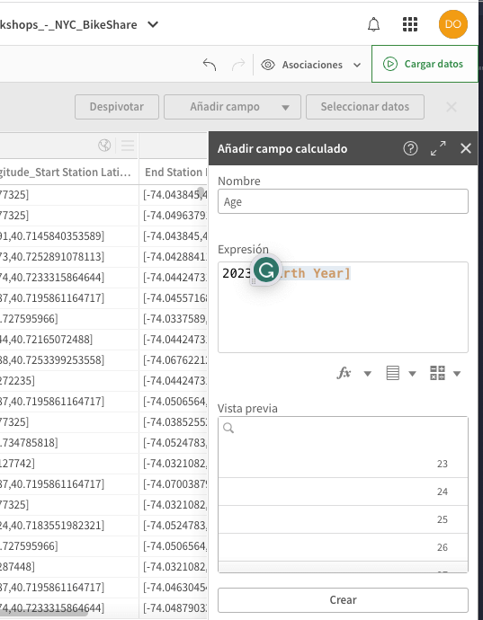

# Case Study of CitiBikes in New York 

From [Taller en vivo de iniciación: Analizamos datos de Bike Sharing](https://www.youtube.com/watch?v=E7szrM2ndHY).

## Background

This project works with data from [CitiBikes](https://citibikenyc.com/system-data).

## Data Visualization with Qlik

### To make graphics we need:
Metrics: Sum(Viajes)
Dimension: period

### 1. Replace gender names 

Replace gender names with the information from the official site.

### 2. 

