# Case Study of CitiBikes in New York 

From [Taller en vivo de iniciación: Analizamos datos de Bike Sharing](https://www.youtube.com/watch?v=E7szrM2ndHY).

## Background

This project works with data from [CitiBikes](https://citibikenyc.com/system-data).

## Data Visualization with Qlik

### To make graphics we need:
* Metrics: Sum(Trips)
* Dimension: period

### 1. Replace gender names 

Replace gender names with the information from the official site.

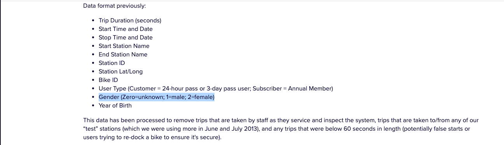

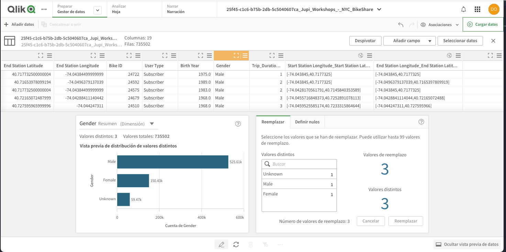

### 2. Add a calculated field 

Add a new field with the age.

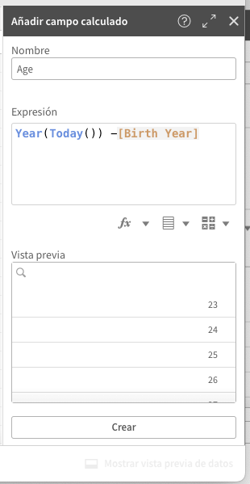

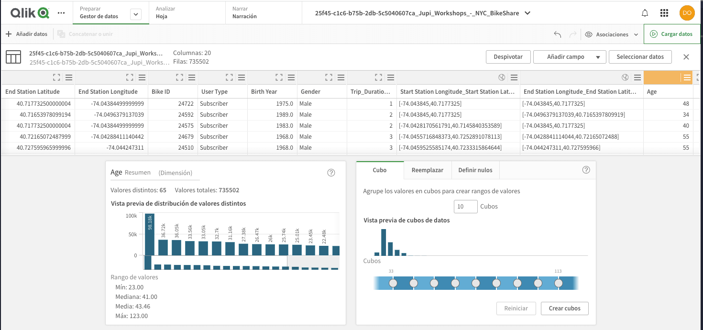

### 3. Create a new analysis from scratch

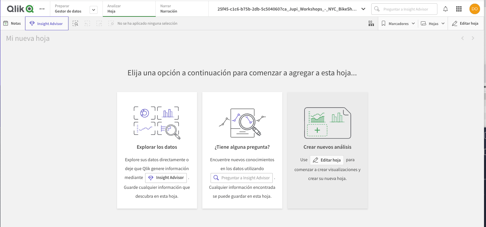

Trips ID by bicycle:

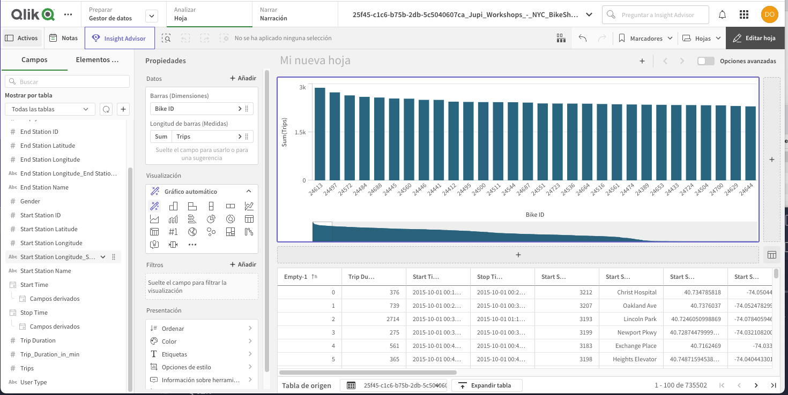

Trips ID by period:

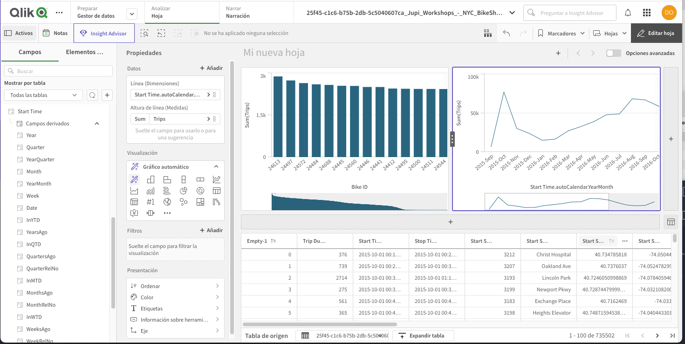

Trips ID by age:

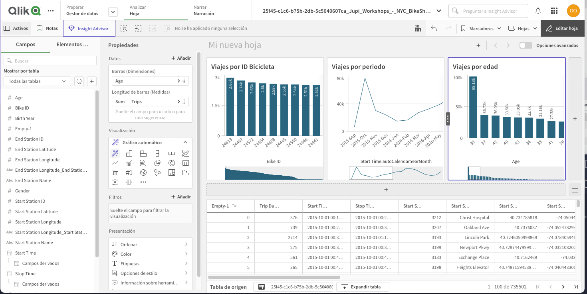

Trips ID by gender:

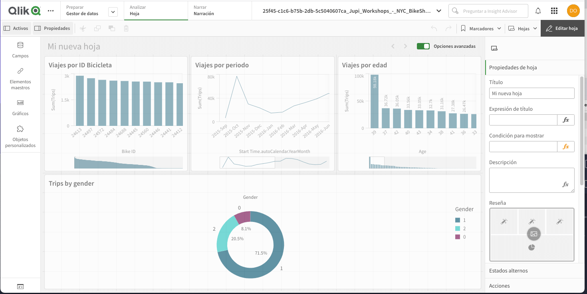

### 3. Advanced Tools

Use of maps for the longitude and latitude values from the estations:

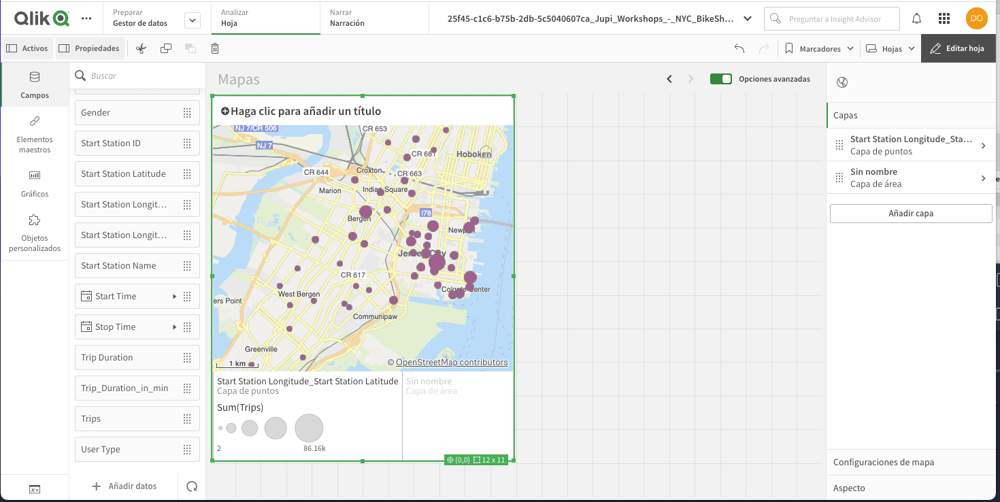

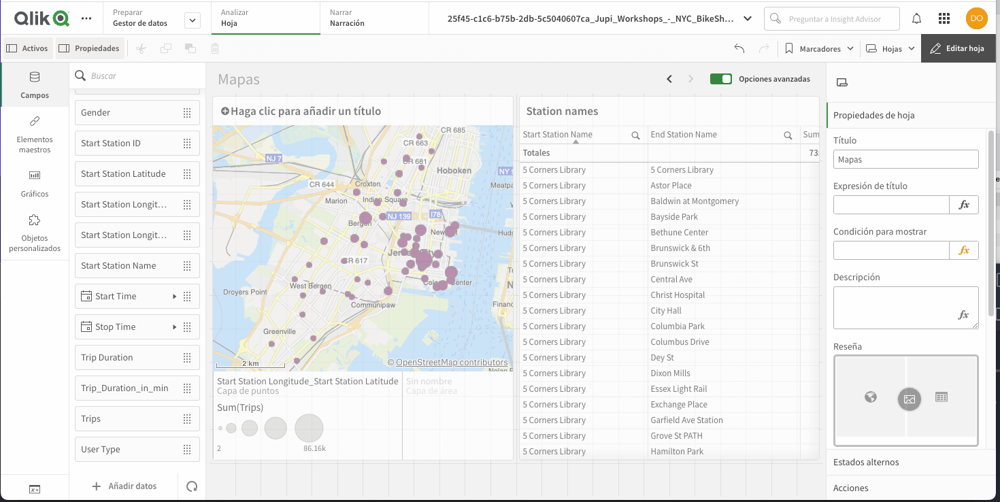

